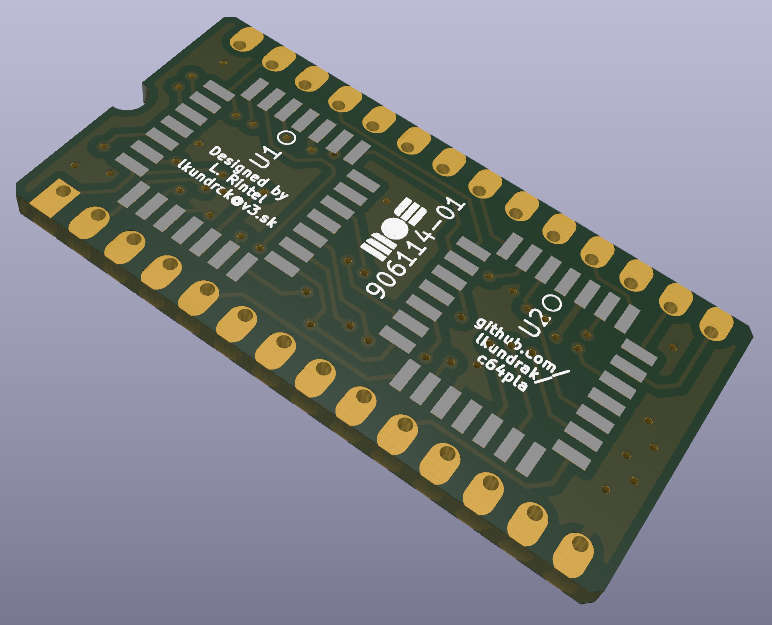
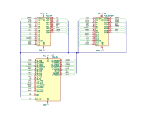

yac64pla -- Yet Another PLD-based C64 PLA replacement
=====================================================

TLDR: This is a derivative of `c64pla`_, the C64 PLA replacement project that
utilizes dual GAL chips. This one uses PLCC28 packages instead of DIL32
and that's basically it.

Warning: This hasn't been tested yet! It will be once the parts arrive.

PLA replacements and the original c64pla
----------------------------------------

For as long as C64 PLA chips like to fail, clever people have been finding
ways to replace them.

In my opinion, the cheapest and most elegant approach was taken by Daniël
Mantione: replace the original, difficult to obtain, logic array with a pair
of slightly smaller GAL programmable logic chips. Cheap, simple and reliable.

Now stop reading and read the documentation of Daniël's `c64pla`_ first.

.. _c64pla: https://www.freepascal.org/~daniel/c64pla/

Really. This document assumes you've read the above. From this point on,
it only deals with what's different in my version.

Why this project exists
-----------------------

The only problem I saw with the original project is that it's not pretty.
The pair of long, thin and noodly DIL24 packages obscenely extends to the
sides, angering the gods and completely ruining the feng-shui of the general area.

I set out to it fix and ended up replace the DIL 24 parts with much tinier
PLCC 28 footprints, so that the board will not be larger than an usunal DIL part.

That's it. If you don't care about the looks, or like the dual-DIL looks of
the original, use the original project. This one is not objectively better.

The board
---------

No real picture yet, since the parts haven't arrived yet.

Schematic
---------

Parts
-----

GAL (and compatible ATF) family devices that use PLCC-28 can be used.
In particular, that's GAL20V8, GAL22V10, ATF20V8 or ATF22V10.

Building it
-----------

1. Order the PCB. With the KiCAD's PCBway and JLC plugis (perhaps others),
   it's really little more than one click away.

2. Program the JED files on to the PLDs. I use the TL866-II programmer with
   the `minipro`_ tool. You'll also need the PLCC-28 to DIL-24 adapter.

   The repository contains the pre-built JED files for individual chips of
   supported device families:

   yac64pla-top-20V8.jed
      Top chip programming for GAL20V8 or ATF20V8 devices.

   yac64pla-bot-20V8.jed
      Bottom chip programming for GAL20V8 or ATF20V8 devices.

   yac64pla-top-22V10.jed
      Top chip programming for GAL22V10 or ATF22V10 devices.

   yac64pla-bot-22V10.jed
      Bottom chip programming for GAL22V10 or ATF22V10 devices.

3. Solder it. Even though there are SMD parts, they're large enough for
   them not to be difficult to hand-solder.

.. _minipro: https://gitlab.com/DavidGriffith/minipro

Should you need any help, find out if there's a Hackerspace in your area.
You're certain to find someone who's going to help you acquire the skills
you need.

You may try dropping me a message. I'd be happy to help but note I haven't
figured out how not to suck at e-mail yet.

PLD programming
---------------

The c64pla is programmed with WinCUPL. Thus sucks, because while it's
feature rich, it's pretty terrible, aged and proprietary tool. Also, I don't
really know how to use it. I redid it in GALasm format, which can be
compiled by `galette`_, a modern free software tool. It's much simpler, but
perfectly appropriate for the job.

.. _galette: https://github.com/simon-frankau/galette

Apart from a rewrite in GALasm, I created a Perl script that can regenerate
the GALasm files for different pin layout and move the logic equations
across the chips. It also updates the KiCAD schematic, ensuring the PCB
stays up to date. This is probably not too useful now, but it enabled me to
shuffle pins around when choosing a good enough pin layout for the tight
routing on the small PCB.

Licensing
---------

Given how ignorant am I about legal aspect of the project, and how unlikely
are the lawyers to knock on my door and take everything that's dear to me,
I decided to not give a shit.

I'm placing the parts of the project I've done into the Public Domain.

Love,
Lubo
